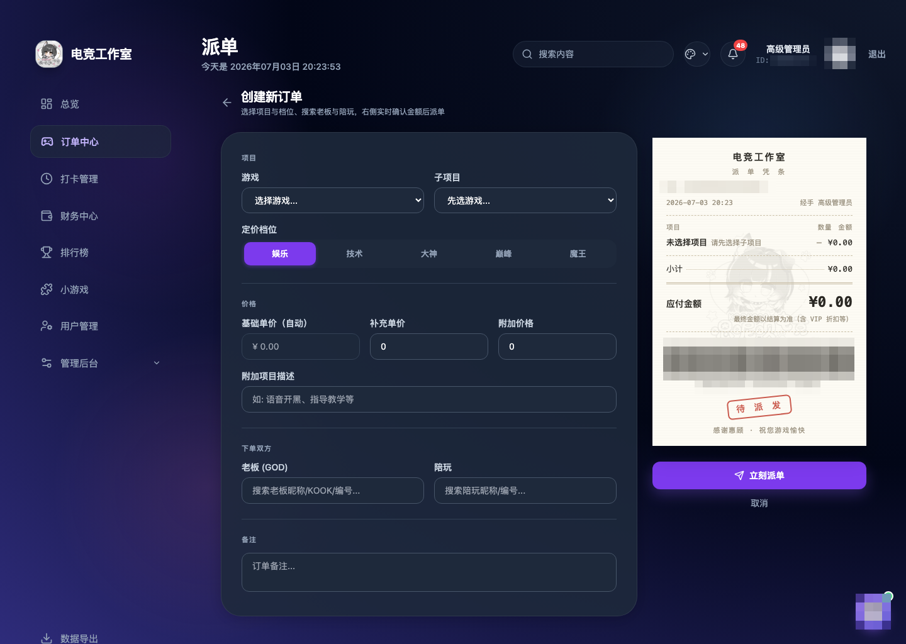
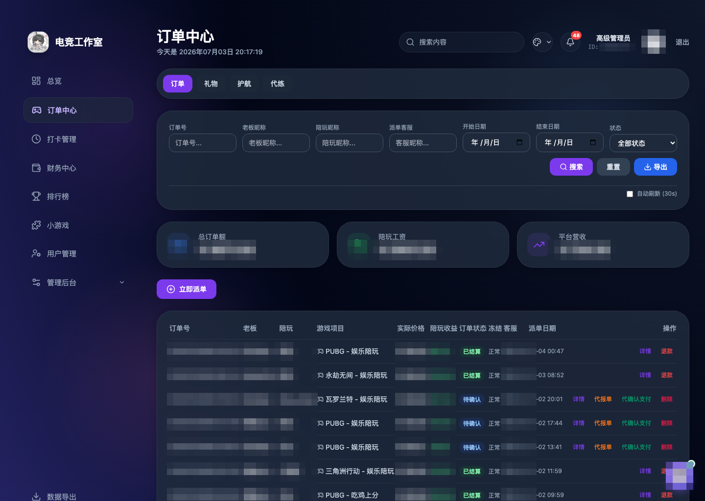
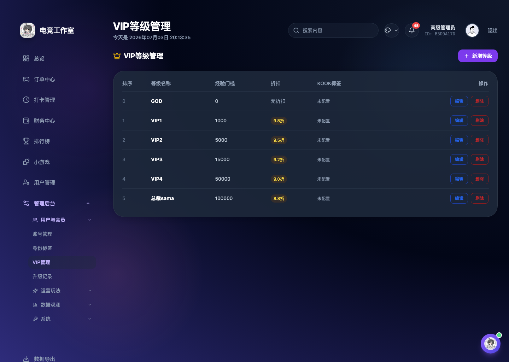
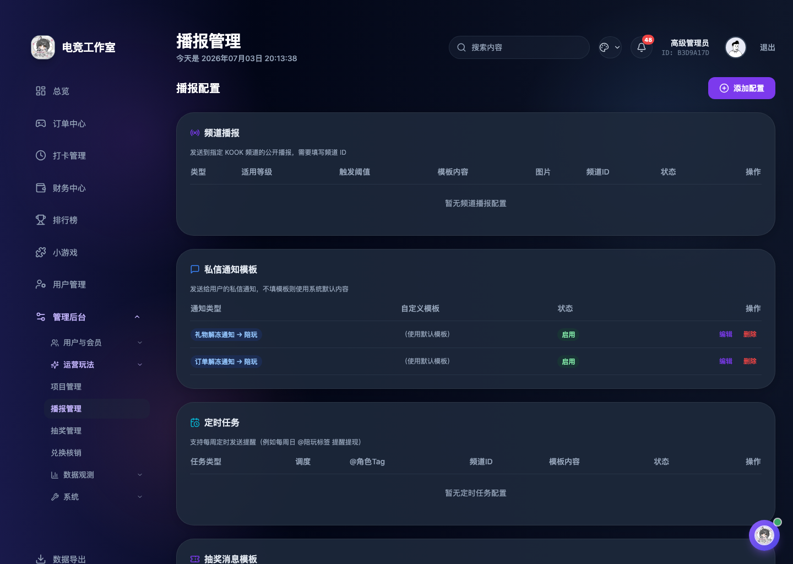

# 陪玩 / 电竞工作室 后台管理系统

> 一套面向陪玩 / 电竞工作室的完整运营后台，Web 管理端 + 群机器人深度打通，覆盖派单、结算、钱包、会员、播报、数据统计全流程。
>
> **本仓库仅作效果展示，源码不公开。** 需要部署或定制请加微信详谈。

---

## ✨ 功能亮点

- **派单与订单**：常规陪玩 / 护航 / 代练分区派单，申报、确认、结算、退款全流程，订单冻结与解冻。
- **钱包与财务**：充值、赠金、消费、提现审核，多币种余额与冻结额实时对账，收支明细可导出 Excel。
- **会员体系（VIP）**：按经验值自动升级，等级折扣自动生效，升级播报与专属权益。
- **群机器人集成**：钱包查询、结单、提现、抽奖、菜单等指令；充值 / 礼物 / 升级 / 订单自动私信与频道播报。
- **礼物系统**：送礼下单、冠名播报、礼物图自动上传与缓存。
- **运营工具**：抽奖（普通 / 互动）、打卡、聊天与挂机统计、身份标签、权限分级、操作日志。
- **多主题 + 暗色模式**：一键换肤，全站响应式，移动端适配。
- **稳定架构**：Web / 定时任务 / 机器人 三进程分离，自动化部署，数据库迁移管理。

## 🛠 技术栈

`Python · Flask · MySQL · SQLAlchemy · APScheduler · 群机器人 WebSocket · 自动化部署`

---

## 📷 效果展示

> 把脱敏后的截图放进 `screenshots/` 目录，替换下面的占位。

| 派单大厅 | 订单结算 |
| --- | --- |
|  |  |

| 钱包 / 提现 | 会员等级 |
| --- | --- |
|  |  |

| 数据统计 | 机器人播报 |
| --- | --- |
|  |  |

---

## 🤝 承接服务

- **部署上线**：帮你把系统跑起来，含服务器环境、数据库、机器人、自动部署配置。
- **二次开发**：在现有系统上加功能、改逻辑、对接你的业务。
- **定制开发**：按你的玩法从零定制陪玩 / 电竞 / 社群运营后台。
- **长期维护**：按需维护、答疑、迭代。

## 📮 联系方式

**微信：ToDoHaCambiado**（加好友请备注「后台系统」）

> 报价与周期视需求而定，详情微信面谈。
